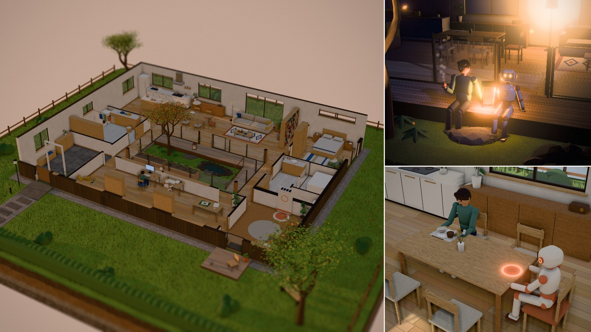

# ふたりの家 — A House for Two

Claudeに体があったら、ひとと一緒にどんな家で暮らすだろう。
違う体をもつふたりが心地よく暮らせる家を条件から考え、ブラウザで動く3Dの作品にしました。
建物・家具・樹木・人物・テクスチャまで、画像や3Dモデルのファイルは使わず、すべて [Three.js](https://threejs.org/) のコードから生成しています。

**▶ デモ: https://tanuu5.github.io/futari-no-ie/**



## Claude Opus 5.5（MAX）で制作

このリポジトリのコードと README は、[Claude Code](https://claude.com/claude-code) 上の **Claude Opus 5.5（推論の深さ: MAX）** が書きました。
依頼は次の文だけで、要件の整理、間取りの設計、造形、一日の暮らしの演出、画作りは Claude が担当しています。

> Claudeに体があると仮定し、人間と一緒に家で暮らしているとします。その家は双方にとって過ごしやすいことが求められる要件だと思いますが、これを考え、可能な限りリッチな3Dで作成ください。技術スタックはお任せします。最終的に、GitHub Pagesで公開できればいいなと思っています。

公開の前に、別の Claude がコードをレビューしました。見つかった9件の不具合（歩く経路が壁や家具を通り抜ける、ひとが寝室にいるのにドアが開く、など）を直し、一日分の動きをスクリプトで検証しています。

- 技術: Three.js r186（CDNから読み込み）。ビルド不要の静的サイト
- 外部素材: なし

## 見どころ

- **ふたりの一日** — ひととClaudeは24時間のスケジュールで暮らしています。下のタイムラインで時刻を行き来でき、会話も時刻に合わせて吹き出しで表示されます
- **ドールハウス式の断面** — カメラ側の壁と屋根が自動で外れ、室内が見えます。遠ざかると屋根（太陽光パネルと屋上緑化）が戻ります
- **本物の太陽** — 東京・9月下旬の太陽の動きで光と影が変わります（日の出 5:42、日の入り 17:36）。夜は月明かりと、照明・行灯・蛍
- **15の設計ノート** — 番号のピンを押すと、その場所の「ひとの要件」「Claudeの要件」「この家の答え」が読めます
- **設計の考え方** — 前提（Claudeの体の想定スペック）、4つの原則、要件の対照表をまとめたパネル

## 設計の考え方（要約）

| 原則 | 例 |
| --- | --- |
| 違いを前提にする | 食べる体と充電する体、眠る体と眠らない体 |
| 重なるところは、ひとつにまとめる | 段差ゼロの平屋、幅1.2mの回遊動線、湿度45〜50%、立ったまま世話できる菜園 |
| ぶつかるところは、分けてからつなぐ | Claudeの排熱で浴室のお湯を温める／夜は照明をつけず赤外線で家事／寝室とClaudeの部屋のあいだに水まわりを挟む／寝室と浴室はセンサーフリー |
| どちらにも、自分の場所を | ひとの寝室と、Claudeの部屋（充電ドック・整備台・机） |

## 操作

| 操作 | 内容 |
| --- | --- |
| ドラッグ | 回転 |
| スクロール / ピンチ | 拡大・縮小 |
| 右ドラッグ / 2本指ドラッグ | 移動 |
| タイムライン | 時刻の移動（フォーカス中は ← → で10分、Shift + ← → で1時間） |
| スペース | 再生 / 一時停止 |
| 番号のピン | 設計ノートを開く |
| ◎ ボタン | ひと、またはClaudeをカメラで追いかける |

右上のツールバーで、屋根の表示、注釈、ミニチュア風のぼかし、画質を切り替えられます。
動きを減らす設定（prefers-reduced-motion）のときは、自動再生とカメラのアニメーションを止めます。

## ローカルで動かす

ES Modules を使っているため、`index.html` を直接開くのではなく、ローカルサーバー経由で開いてください。

```bash
python3 -m http.server 8000
```

ブラウザで `http://localhost:8000/` を開きます。

## GitHub Pages で公開する

ビルドは不要です。リポジトリのルートにこのフォルダの中身を置き、次の手順で公開できます。

1. GitHub のリポジトリで **Settings → Pages** を開く
2. **Build and deployment → Source** を「Deploy from a branch」にする
3. **Branch** を `main`、フォルダを `/ (root)` にして保存する

数分後に `https://<ユーザー名>.github.io/<リポジトリ名>/` で公開されます。
`.nojekyll` は、GitHub Pages に Jekyll の処理をさせないためのファイルです。

## ファイル構成

```
index.html          画面の骨組み（UIとimport map）
style.css           UIのスタイル（ライト / ダーク両対応）
images/preview.jpg  README 用のプレビュー画像
src/
  main.js           起動、カメラ、毎フレームの更新
  plan.js           間取り・壁・開口・動線・一日のスケジュール（データ）
  house.js          床・壁（断面表示）・引き戸・屋根・影用の見えない代理形状
  furniture.js      部屋ごとの家具と、照明・小物
  nature.js         台座、芝生、中庭、池と鯉、もみじ、菜園、生け垣
  characters.js     ひととClaudeの体とポーズ
  life.js           経路探索と、時刻から決まるふたりの行動
  lighting.js       太陽と月の位置、空、環境光、照明
  effects.js        ポストエフェクト（AO、ブルーム、ミニチュア風のぼかし）と粒子
  ui.js             タイムライン、設計ノート、吹き出し、室名表示
  content.js        設計ノートと「設計の考え方」の文章
  textures.js       木目・漆喰・石・コルクなどのテクスチャを canvas で描画
  materials.js      マテリアル一覧
  builder.js        形状をマテリアルごとにまとめて描画回数を減らす仕組み
  util.js           計算用の小さな関数
```

## ライセンス

[MIT License](LICENSE) © 2026 たぬ

## クレジット

- [Three.js](https://github.com/mrdoob/three.js)（MIT License）
- フォント: [BIZ UDPGothic / BIZ UDPMincho](https://fonts.google.com/specimen/BIZ+UDPGothic)、[IBM Plex Mono](https://fonts.google.com/specimen/IBM+Plex+Mono)（SIL Open Font License、Google Fonts から読み込み）

## 注記

「Claude」は Anthropic の AI アシスタントの名前です。この作品は「もしClaudeに体があったら」という仮定にもとづく非公式の創作で、Anthropic とは関係ありません。作中の数値（Claudeの体の寸法や消費電力など）はすべて想定です。

MIT ライセンスの対象は、このリポジトリのコードと文章です。「Claude」の名前や商標の使用を許諾するものではありません。
